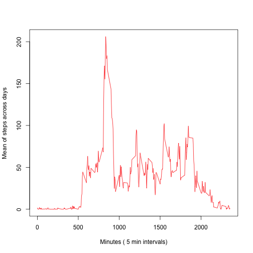
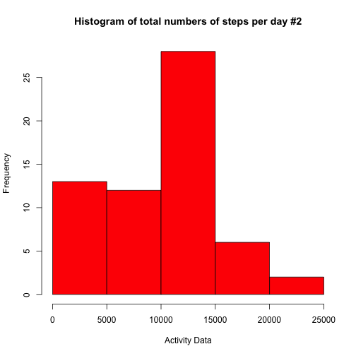
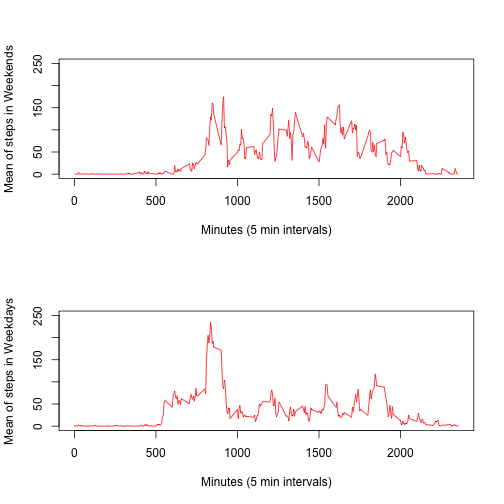

## Loading and preprocessing the data
Ufter unzipping the data, we find a "csv"" file, which can be loaded into R by read.csv

```r
ActData<-read.csv("activity.csv")
```

## What is mean total number of steps taken per day?
1. To plot a histogram of the toal number of steps taken each day, I perform a "tapply" function on ActData for summing up the numbers of steps in each day. I then plot the histogram, using default values. The data indicate that the mean is around 15000 steps per day.


```r
ActData2<-tapply(ActData$steps, ActData$date, FUN=sum)
hist(ActData2, breaks=6, col="red", main="Histogram of total numbers of steps per day", xlab="Activity Data")
```

 

2a. To calculate and report the mean and the median of the number of steps taken each day, I omit the NA values from ActData2 dataframe. The average and median are within the highest column of the histogram suggesting that the histogram plot represents reliably the Gaussian-like distribution of the total number of steps across all days.


```r
MeanofSteps<-mean(ActData2[!is.na(ActData2)])
MedianofSteps<-median(ActData2[!is.na(ActData2)])
print (c("MeanofSteps"=MeanofSteps, "Median of Steps"=MedianofSteps))
```

```
##     MeanofSteps Median of Steps 
##           10766           10765
```

2b. I also perform a "tapply" function on ActData, similar to the previous task. I then bind all the data together in a dataframe called "Total Data", name the columns and print it out. These are the averages and medians for each 5 minute interval.

```r
##Report in Total Data the sum mean and median of steps for each day
ActData3<-tapply(ActData$steps, ActData$date, FUN=mean)
ActData4<-tapply(ActData$steps, ActData$date, FUN=median)
TotalData<-cbind(as.data.frame(ActData2), ActData3, ActData4)
names(TotalData)<-c("Sum", "Mean", "Median")
print (TotalData)
```

```
##              Sum    Mean Median
## 2012-10-01    NA      NA     NA
## 2012-10-02   126  0.4375      0
## 2012-10-03 11352 39.4167      0
## 2012-10-04 12116 42.0694      0
## 2012-10-05 13294 46.1597      0
## 2012-10-06 15420 53.5417      0
## 2012-10-07 11015 38.2465      0
## 2012-10-08    NA      NA     NA
## 2012-10-09 12811 44.4826      0
## 2012-10-10  9900 34.3750      0
## 2012-10-11 10304 35.7778      0
## 2012-10-12 17382 60.3542      0
## 2012-10-13 12426 43.1458      0
## 2012-10-14 15098 52.4236      0
## 2012-10-15 10139 35.2049      0
## 2012-10-16 15084 52.3750      0
## 2012-10-17 13452 46.7083      0
## 2012-10-18 10056 34.9167      0
## 2012-10-19 11829 41.0729      0
## 2012-10-20 10395 36.0938      0
## 2012-10-21  8821 30.6285      0
## 2012-10-22 13460 46.7361      0
## 2012-10-23  8918 30.9653      0
## 2012-10-24  8355 29.0104      0
## 2012-10-25  2492  8.6528      0
## 2012-10-26  6778 23.5347      0
## 2012-10-27 10119 35.1354      0
## 2012-10-28 11458 39.7847      0
## 2012-10-29  5018 17.4236      0
## 2012-10-30  9819 34.0938      0
## 2012-10-31 15414 53.5208      0
## 2012-11-01    NA      NA     NA
## 2012-11-02 10600 36.8056      0
## 2012-11-03 10571 36.7049      0
## 2012-11-04    NA      NA     NA
## 2012-11-05 10439 36.2465      0
## 2012-11-06  8334 28.9375      0
## 2012-11-07 12883 44.7326      0
## 2012-11-08  3219 11.1771      0
## 2012-11-09    NA      NA     NA
## 2012-11-10    NA      NA     NA
## 2012-11-11 12608 43.7778      0
## 2012-11-12 10765 37.3785      0
## 2012-11-13  7336 25.4722      0
## 2012-11-14    NA      NA     NA
## 2012-11-15    41  0.1424      0
## 2012-11-16  5441 18.8924      0
## 2012-11-17 14339 49.7882      0
## 2012-11-18 15110 52.4653      0
## 2012-11-19  8841 30.6979      0
## 2012-11-20  4472 15.5278      0
## 2012-11-21 12787 44.3993      0
## 2012-11-22 20427 70.9271      0
## 2012-11-23 21194 73.5903      0
## 2012-11-24 14478 50.2708      0
## 2012-11-25 11834 41.0903      0
## 2012-11-26 11162 38.7569      0
## 2012-11-27 13646 47.3819      0
## 2012-11-28 10183 35.3576      0
## 2012-11-29  7047 24.4688      0
## 2012-11-30    NA      NA     NA
```

## What is the average daily activity pattern?
1. To make a time-series plot (type="l") of the average number of steps across all days (on the Y axis) for each of the 5 minute interval (on the X axis), I first order the dataframe according to time intervals and then make a new dataframe, ommiting "NA" values. Subsequently, I apply a "tapply" function for calculating the mean of number of steps in relation to intervals across all days.
Results are then gathered in a new dataframe where the intervals are one of the columns.
I plot one column (average of number of steps) as a red line over the other column (intervals).


```r
A<-ActData[order(ActData[,3]), ]
A2<-A[!is.na(A$steps),]
A3<-as.data.frame(tapply(A2$steps, A2$interval, mean))
names(A3)<-"mean"
A4<-data.frame("INTERVALS"=as.numeric(rownames(A3)),"Mean"=unname(A3$mean))
plot(A4$INTERVALS, A4$Mean, xlab="Minutes ( 5 min intervals)", ylab="Mean of steps across days", type='l', col="red")
```

 

2. To calculate which interval has the maximum number of steps on average across all days, I find the maximum of the averages and use it to index out of the dataframe A4 the interval. I then print it ou following a statement.


```r
MaxInterval<-A4[A4$Mean==max(A4$Mean), ]$INTERVALS
print (paste("The interval that contains the maximum number of steps across all the days is:",MaxInterval))
```

```
## [1] "The interval that contains the maximum number of steps across all the days is: 835"
```

## Imputing missing values
1. To calculate and report the total number of missing values, I use the "which" function to extract them from the original dataframe that contained them (ActData). I then print out the result following a statement.


```r
NAinSteps<-which(is.na(ActData$steps))
Num.of.NAs<-paste("The total number of rows with NAs:", length(which(is.na(ActData$steps))))
print (Num.of.NAs)
```

```
## [1] "The total number of rows with NAs: 2304"
```

2. To estimate whether "correcting" for the missing values has a dramatic effect on our calculations
I substituted the missing values with 0. I then draw the histogram plot, and calculate the mean and the median of the new dataframe ActData5, which is the original dataframe with the missing values substituted as 0. The mean and the media have indeed changed, with the mean more than the median ( in the range of approximately of 13% and 3% respectively). A better approximation is required, but due to the constraints of time I moved on the next question.  


```r
ActData5<-ActData
ActData5$steps[NAinSteps]<-0
ActData6<-tapply(ActData5$steps, ActData5$date, FUN=sum)
hist(ActData6, breaks=6, col="red", main="Histogram of total numbers of steps per day #2", xlab="Activity Data")
```

 

```r
MeanofStepsWithAdjustedValues<-mean(ActData6)
MedianofStepsWithAdjustedValues<-median(ActData6)
print (c("Mean of Steps With Adjusted Values"=MeanofStepsWithAdjustedValues, "Median of Steps With Adjusted Values"=MedianofStepsWithAdjustedValues))
```

```
##   Mean of Steps With Adjusted Values Median of Steps With Adjusted Values 
##                                 9354                                10395
```

## Are there differences in activity patterns between weekdays and weekends?
1.To estimate the differences in activity pattern between weekdays and weekends, I first convert the dates into days and then into weekdays or weekend days. To do that, I use a loop to construct a vector that codes and factors days into weekdays or weekend days. The data are constructed in a new dataframe called ActData9a. The first 30 rows and the structure of ActData9a dataframe are printed out.


```r
##Calculate the mean number of steps per 5 min intervals in weekdays vs weekends

#Convert Factor Date to character Days, name them and integrate them along with the old dataframe in a new one. Then, use a loop to construct a vector that codes and factors days into weekdays or weekend days.
x<-weekdays(as.Date(as.character(ActData$date)))
ActData9<-cbind(ActData, x)
names(ActData9)[4]<-"Day"
factorDay<-vector()
for (i in seq_along(ActData9$Day)){
  if (ActData9$Day[i]=="Sunday"|ActData9$Day[i]=="Saturday"){factorDay[i]="Weekend"}
  else {factorDay[i]="Weekday"}
  }
ActData9a<-cbind(ActData9, "factorDay"=factorDay)
print(head(ActData9a, 30))
```

```
##    steps       date interval    Day factorDay
## 1     NA 2012-10-01        0 Monday   Weekday
## 2     NA 2012-10-01        5 Monday   Weekday
## 3     NA 2012-10-01       10 Monday   Weekday
## 4     NA 2012-10-01       15 Monday   Weekday
## 5     NA 2012-10-01       20 Monday   Weekday
## 6     NA 2012-10-01       25 Monday   Weekday
## 7     NA 2012-10-01       30 Monday   Weekday
## 8     NA 2012-10-01       35 Monday   Weekday
## 9     NA 2012-10-01       40 Monday   Weekday
## 10    NA 2012-10-01       45 Monday   Weekday
## 11    NA 2012-10-01       50 Monday   Weekday
## 12    NA 2012-10-01       55 Monday   Weekday
## 13    NA 2012-10-01      100 Monday   Weekday
## 14    NA 2012-10-01      105 Monday   Weekday
## 15    NA 2012-10-01      110 Monday   Weekday
## 16    NA 2012-10-01      115 Monday   Weekday
## 17    NA 2012-10-01      120 Monday   Weekday
## 18    NA 2012-10-01      125 Monday   Weekday
## 19    NA 2012-10-01      130 Monday   Weekday
## 20    NA 2012-10-01      135 Monday   Weekday
## 21    NA 2012-10-01      140 Monday   Weekday
## 22    NA 2012-10-01      145 Monday   Weekday
## 23    NA 2012-10-01      150 Monday   Weekday
## 24    NA 2012-10-01      155 Monday   Weekday
## 25    NA 2012-10-01      200 Monday   Weekday
## 26    NA 2012-10-01      205 Monday   Weekday
## 27    NA 2012-10-01      210 Monday   Weekday
## 28    NA 2012-10-01      215 Monday   Weekday
## 29    NA 2012-10-01      220 Monday   Weekday
## 30    NA 2012-10-01      225 Monday   Weekday
```

```r
print(str(ActData9a))
```

```
## 'data.frame':	17568 obs. of  5 variables:
##  $ steps    : int  NA NA NA NA NA NA NA NA NA NA ...
##  $ date     : Factor w/ 61 levels "2012-10-01","2012-10-02",..: 1 1 1 1 1 1 1 1 1 1 ...
##  $ interval : int  0 5 10 15 20 25 30 35 40 45 ...
##  $ Day      : Factor w/ 7 levels "Friday","Monday",..: 2 2 2 2 2 2 2 2 2 2 ...
##  $ factorDay: Factor w/ 2 levels "Weekday","Weekend": 1 1 1 1 1 1 1 1 1 1 ...
## NULL
```


On the basis of that binary dstinction I make two dataframes, one for weekdays and one for weekends. Both dataframes are similar structurally to the that was used in the second task to calculate the averages over all days for each of the 5 minute intervals, but they contain only a subset of the original data and ofcourse, lacking any "NA" values.

```r
#Make two dataframes; one for weekends and one for weekdays
Weekends<-rbind(ActData9[as.character(ActData9$Day)==c("Sunday"), ], ActData9[as.character(ActData9$Day)==c("Saturday"), ])
Weekdays<-ActData9[as.character(ActData9$Day)!=c("Sunday"), ]
Weekdays<-Weekdays[as.character(Weekdays$Day)!=c("Saturday"), ]

#Calculate the mean number of steps as previously but only in the weekend dataframe
Weekends<-Weekends[order(Weekends[, 3]), ]
Weekends2<-Weekends[!is.na(Weekends$steps), ]
Weekends3<-as.data.frame(tapply(Weekends2$steps, Weekends2$interval, mean))
names(Weekends3)<-"mean"
Weekends4<-data.frame("INTERVALS"=as.numeric(rownames(Weekends3)),"Mean"=unname(Weekends3$mean))
```

I then make two plots, stcked over each other, using the same scale, for direct comparison.
The plots indicate that in the weekends, there is more activity, throughout the day, while during weekdays, there is an initial spark of intense activity, followed by a pattern of relative inactivity.


```r
#Calculate mean number of steps for each interval as previously but only in the weekday dataframe
Weekdays<-Weekdays[order(Weekdays[, 3]), ]
Weekdays2<-Weekdays[!is.na(Weekdays$steps), ]
Weekdays3<-as.data.frame(tapply(Weekdays2$steps, Weekdays2$interval, mean))
names(Weekdays3)<-"mean"
Weekdays4<-data.frame("INTERVALS"=as.numeric(rownames(Weekdays3)),"Mean"=unname(Weekdays3$mean))

#Plot in 2 rows and 1 column the different results as a line of means over the 5 minute intervals. One plot is for the the weekends and the other for the weekdays
par(mfrow=c(2,1))
plot(Weekends4$INTERVALS, Weekends4$Mean, ylim=c(0,250), xlab="Minutes (5 min intervals)", ylab="Mean of steps in Weekends", type='l', col="red")
plot(Weekdays4$INTERVALS, Weekdays4$Mean, ylim=c(0,250), xlab="Minutes (5 min intervals)", ylab="Mean of steps in Weekdays", type='l', col="red")
```

 
